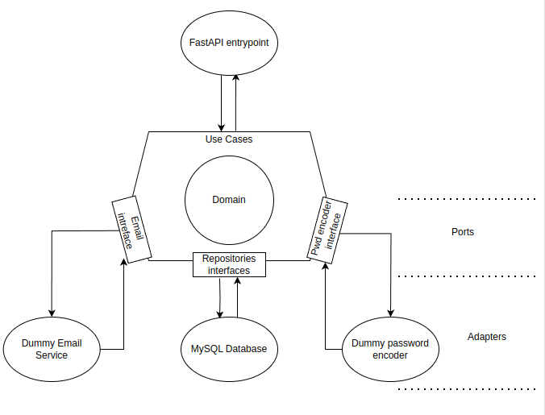

This project is a user registration API using FastAPI and following 
hexagonal architecture concepts (ports and adapters).

## Start

Start the application with:

`docker compose up --build`

The application is running on http://localhost:8000.  
Technical documentation and manual testing are available on `/docs`.  
Activation code is sent through the app container's console, with the other container logs.

## Test

With the app container running, automatic testing can be launched with: 

`docker exec app pytest`

OR 

enter the container with:

`docker exec -it app bash`

once inside the container:

`pytest`
